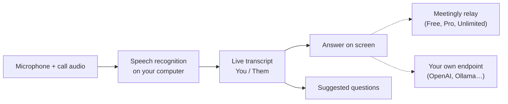

<div align="center">


# Meetingly

**La respuesta, mientras aún están preguntando.**

Un asistente de AI de código abierto para reuniones y entrevistas en vivo. Escucha la llamada, la transcribe en tu propio ordenador y muestra la respuesta en pantalla en cuanto se hace una pregunta. Gratis con una cuenta, o usa tu propia clave de OpenAI, OpenRouter u Ollama. Una alternativa de código abierto a Cluely.

<p align="center"><!-- languages --><a href="README.md">English</a> · <a href="README.zh-CN.md">简体中文</a> · <a href="README.ru.md">Русский</a> · <b>Español</b> · <a href="README.pt-BR.md">Português</a> · <a href="README.ja.md">日本語</a> · <a href="README.ko.md">한국어</a></p>

<a href="https://meetinglyai.com/download/Meetingly-Setup.exe"></a>
&nbsp;
<a href="https://meetinglyai.com/download/Meetingly-mac-arm64.dmg"></a>
&nbsp;
<a href="https://meetinglyai.com/download/Meetingly-linux.AppImage"></a>

<sub>También: <a href="https://meetinglyai.com/download/Meetingly-mac-x64.dmg">Intel Mac</a> · <a href="https://meetinglyai.com/download/Meetingly-linux.deb">Debian / Ubuntu (.deb)</a> · <a href="https://meetinglyai.com/download/Meetingly.exe">Windows portable</a> · <a href="https://meetinglyai.com">meetinglyai.com</a></sub>


</div>

## Funciones

- **Respuestas reales, al instante.** Cuando la otra parte pregunta algo, la respuesta aparece de inmediato: una línea en negrita que puedes decir y luego algunos puntos clave para ampliar. Sin coaching, sin "podrías mencionar…".
- **Preguntas sugeridas.** Una columna lateral sigue la conversación y ofrece preguntas con un clic: la pregunta que te acaban de hacer, términos que surgieron, la probable siguiente pregunta.
- **Reconocimiento de voz en tu ordenador.** NVIDIA Nemotron se ejecuta localmente en 28 idiomas, así que tu audio nunca sale de tu equipo y no hay coste por minuto.
- **Tú y ellos, separados.** Tu micrófono y el audio de la llamada se transcriben por separado, así que la transcripción se lee como un chat.
- **Análisis de pantalla.** Un clic lee lo que hay en tu pantalla (una tarea de programación, una diapositiva, una pregunta) y lo responde.
- **Oculto al compartir pantalla.** Las ventanas se excluyen de las pantallas compartidas y grabaciones en Windows y macOS.
- **Informes de reunión.** Cada reunión termina con un resumen, decisiones, tareas y seguimientos.
- **Tu propia clave de API, o ninguna nuestra.** Usa el plan gratis, o apunta Meetingly a OpenAI, OpenRouter, un modelo local de Ollama o cualquier endpoint compatible con OpenAI.
- **Se actualiza solo** en Windows, macOS y Linux, nunca en medio de una llamada.

## Dos formas de usarlo

**Cuenta gratis.** Haz clic en *Sign up free* en el panel: 50 respuestas de AI al día, sin tarjeta. Las instrucciones (tu CV, la descripción del puesto), los ajustes y los informes de reunión están en tu [panel web](https://account.meetinglyai.com) y se sincronizan con todos tus ordenadores.

| | Free | Pro | Unlimited |
|---|---|---|---|
| Precio | $0 | $19.99 / mes, 7 días gratis | $39.99 / mes |
| Modelos de AI | Modelos de AI rápidos | Últimos modelos GPT y Claude | Los modelos GPT y Claude más nuevos y potentes, primero |
| Respuestas | 50 al día | 300 al día | Unlimited (uso razonable) |
| Análisis de pantalla | 3 al día | 50 al día | 300 al día |
| Sugerencias en vivo | Unos 30 minutos al día | Unas 4 horas al día | Unas 8 horas al día |
| Informes de reunión | 1 al día | 20 al día | 100 al día |
| Ordenadores | 1 | 2 | 3 |

Paga con tarjeta, o con SBP o cripto, en la [página de planes](https://account.meetinglyai.com/dashboard/plan). Publica sobre Meetingly y consigue Pro gratis: consulta la [recompensa para creadores](https://meetinglyai.com/creators/).

**Tu propia clave, sin cuenta.** Abre el menú de Meetingly (el icono de la bandeja junto al reloj) y elige *Use your own API key…*, selecciona un proveedor, pega una clave y elige un modelo. Las respuestas van directamente de tu ordenador a ese proveedor; nada pasa por los servidores de Meetingly, y no hay más límites que los de tu proveedor.

| Proveedor | Dirección de API | Clave |
|---|---|---|
| OpenAI | `https://api.openai.com/v1` | de platform.openai.com |
| OpenRouter | `https://openrouter.ai/api/v1` | de openrouter.ai |
| Ollama (totalmente local) | `http://localhost:11434/v1` | ninguna |
| Cualquier cosa compatible con OpenAI (LM Studio, vLLM, LiteLLM…) | su dirección `/v1` | si necesita una |

La clave se guarda en tu ordenador, cifrada con el llavero del sistema operativo. El análisis de pantalla necesita un modelo que acepte imágenes.

## Meetingly vs Cluely vs Final Round AI vs Parakeet AI

| | **Meetingly** | Cluely | Final Round AI | Parakeet AI |
|---|---|---|---|---|
| Precio | **Free**, Pro $19.99, Unlimited $39.99 / mes | Plan Free, Pro $19.99 / mes | Pro desde $25 / mes | €129.90 / mes, o créditos |
| Respuestas en vivo gratis | **50 al día, todos los días** | "Limited AI responses" | Ninguna: las sesiones en vivo necesitan Pro | Una sesión de 10 minutos |
| Oculto al compartir pantalla | **Todos los planes, activado por defecto** | Solo Pro + Undetectability, $149.99 / mes | Pro | Planes de pago |
| Linux | **AppImage y .deb** | — | — | Solo en Chrome |
| Código abierto | **Apache-2.0** | — | — | — |
| Usa tu propia clave de API | **OpenAI, OpenRouter, Ollama…** | — | — | — |

<sub>De la web de cada producto (<a href="https://cluely.com/pricing">cluely.com/pricing</a>, <a href="https://www.finalroundai.com/pricing">finalroundai.com/pricing</a>, <a href="https://www.parakeet-ai.com/pricing">parakeet-ai.com/pricing</a>), 5 de octubre de 2026. — significa que no se menciona allí.</sub>

<div align="center">

</div>

## Cómo funciona



Tu audio se queda en tu ordenador. Solo el texto de la transcripción, tus preguntas y las capturas de pantalla que elijas analizar van a la AI: a través del relay de Meetingly en los planes Free, Pro y Unlimited (guarda las claves del proveedor y elige el modelo para cada tarea), o directamente a tu propio endpoint cuando usas tu propia clave.

## Notas de instalación

Los instaladores aún no están firmados con código, así que el primer inicio lo pedirá una vez:

- **Windows:** SmartScreen dice que la app no se reconoce. Haz clic en *Más información* y luego en *Ejecutar de todos modos*.
- **macOS:** abre Ajustes del Sistema → Privacidad y seguridad y haz clic en *Abrir de todos modos*. Mantén la app en Aplicaciones para que pueda actualizarse sola.
- **Linux:** `chmod +x Meetingly-linux.AppImage` y ejecútalo, o instala el .deb.

## Desarrollo

```bash
cd app
npm install
npm run fetch:asr   # speech engine for your platform
npm run dev
```

| Comando | Qué hace |
|---|---|
| `npm run dev` | Ejecuta con recarga en caliente |
| `npm test` | Pruebas unitarias |
| `npm run typecheck` | Comprueba tipos en main y renderer |
| `npm run smoke` | Abre cada ventana en modo headless y falla ante errores de renderer (`node scripts/smoke.mjs ownkey` prueba el flujo con clave propia) |
| `npm run dist:win` | Genera el instalador de Windows (macOS y Linux se generan en GitHub Actions) |

```
app/      desktop app: Electron 44, React 19, Vite 8, TypeScript, Tailwind
relay/    the small Node service behind the Free, Pro and Unlimited plans (holds the API keys, picks the model per task)
docs/     images for this page
```

Las contribuciones son bienvenidas; consulta [CONTRIBUTING](.github/CONTRIBUTING.md). Problemas de seguridad: [SECURITY](.github/SECURITY.md).

Si Meetingly te ayuda, una ⭐ ayuda a que otras personas lo encuentren.

## Con tecnología de AI Prime Tech

El plan gratuito funciona con **[AI Prime Tech](https://aiprimetech.io)**, el proveedor de la API de Claude con planes de API ilimitados para desarrolladores y empresas.

<div align="center">
<sub>Licencia Apache-2.0.</sub>
</div>
