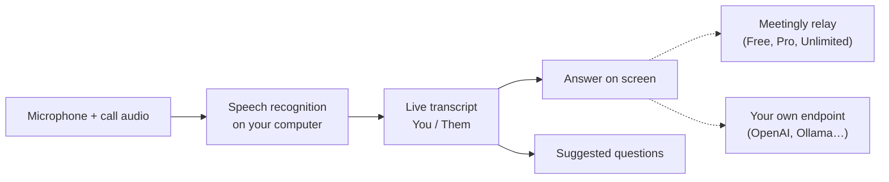

<div align="center">


# Meetingly

**相手がまだ質問している間に、答えを。**

ライブ会議や面接向けのオープンソース AI アシスタントです。通話を聞き取り、自分のコンピューター上で文字起こしし、質問された瞬間に画面へ答えを表示します。アカウントがあれば無料で使えるほか、自分の OpenAI、OpenRouter、Ollama キーも使えます。Cluely のオープンソース代替です。

<p align="center"><!-- languages --><a href="README.md">English</a> · <a href="README.zh-CN.md">简体中文</a> · <a href="README.ru.md">Русский</a> · <a href="README.es.md">Español</a> · <a href="README.pt-BR.md">Português</a> · <b>日本語</b> · <a href="README.ko.md">한국어</a></p>

<a href="https://meetinglyai.com/download/Meetingly-Setup.exe"></a>
&nbsp;
<a href="https://meetinglyai.com/download/Meetingly-mac-arm64.dmg"></a>
&nbsp;
<a href="https://meetinglyai.com/download/Meetingly-linux.AppImage"></a>

<sub>その他: <a href="https://meetinglyai.com/download/Meetingly-mac-x64.dmg">Intel Mac</a> · <a href="https://meetinglyai.com/download/Meetingly-linux.deb">Debian / Ubuntu (.deb)</a> · <a href="https://meetinglyai.com/download/Meetingly.exe">Windows portable</a> · <a href="https://meetinglyai.com">meetinglyai.com</a></sub>


</div>

## 機能

- **本物の答えを、瞬時に。** 相手が何かを質問すると、すぐに答えが表示されます。口に出せる太字の1行と、広げるための要点がいくつか。コーチングでも、「…に触れるとよい」といった提案でもありません。
- **質問の提案。** サイド列が会話を追い、ワンクリックで使える質問を提示します。たった今聞かれた質問、出てきた用語、次に来そうな質問です。
- **自分のコンピューター上で音声認識。** NVIDIA Nemotron が28言語でローカル実行されるため、音声はマシンの外に出ず、分単位のコストもかかりません。
- **自分と相手を分けて表示。** 自分のマイクと通話音声を別々に文字起こしするので、チャットのように読めます。
- **画面分析。** ワンクリックで画面上の内容（コーディング課題、スライド、質問）を読み取り、回答します。
- **画面共有に映りません。** Windows と macOS では、ウィンドウが画面共有や録画から除外されます。
- **会議レポート。** 各会議の終了時に、要約、決定事項、アクション項目、フォローアップを作成します。
- **自分の API キーを使うか、こちらのキーは使わないか。** 無料プランを使うか、Meetingly を OpenAI、OpenRouter、ローカルの Ollama モデル、または任意の OpenAI 互換エンドポイントに向けられます。
- Windows、macOS、Linux で **自動更新** します。通話中には更新しません。

## 2つの使い方

**無料アカウント。** パネルで *Sign up free* をクリックすると、カード不要で1日50件の AI 回答を使えます。指示（履歴書、求人内容）、設定、会議レポートは [web dashboard](https://account.meetinglyai.com) に保存され、すべてのコンピューターに同期されます。

| | Free | Pro | Unlimited |
|---|---|---|---|
| 料金 | $0 | $19.99 / 月、7日間無料 | $39.99 / 月 |
| AI モデル | 高速な AI モデル | 最新の GPT と Claude モデル | 最新かつ最強の GPT と Claude モデルをいち早く |
| 回答 | 1日50件 | 1日300件 | Unlimited（フェアユース） |
| 画面分析 | 1日3件 | 1日50件 | 1日300件 |
| ライブ提案 | 1日約30分 | 1日約4時間 | 1日約8時間 |
| 会議レポート | 1日1件 | 1日20件 | 1日100件 |
| コンピューター | 1 | 2 | 3 |

[plan page](https://account.meetinglyai.com/dashboard/plan) で、カード、SBP、または暗号資産で支払えます。Meetingly について投稿すると Pro が無料になります。詳しくは [creator reward](https://meetinglyai.com/creators/) をご覧ください。

**自分のキーを使い、アカウント不要。** Meetingly メニュー（時計の横にあるトレイアイコン）を開き、*Use your own API key…* を選び、プロバイダーを選択してキーを貼り付け、モデルを選びます。回答は自分のコンピューターからそのプロバイダーへ直接送られます。Meetingly のサーバーは一切経由せず、制限はプロバイダー側のものだけです。

| プロバイダー | API アドレス | キー |
|---|---|---|
| OpenAI | `https://api.openai.com/v1` | platform.openai.com から |
| OpenRouter | `https://openrouter.ai/api/v1` | openrouter.ai から |
| Ollama（完全ローカル） | `http://localhost:11434/v1` | なし |
| OpenAI 互換のもの（LM Studio、vLLM、LiteLLM…） | その `/v1` アドレス | 必要な場合 |

キーは、OS のキーチェーンで暗号化されて自分のコンピューターに保存されます。画面分析には、画像を受け付けるモデルが必要です。

## Meetingly vs Cluely vs Final Round AI vs Parakeet AI

| | **Meetingly** | Cluely | Final Round AI | Parakeet AI |
|---|---|---|---|---|
| 料金 | **Free**、Pro $19.99、Unlimited $39.99 / 月 | Free プラン、Pro $19.99 / 月 | Pro は $25 / 月から | €129.90 / 月、またはクレジット |
| 無料のライブ回答 | **毎日50件** | "Limited AI responses" | なし: ライブセッションには Pro が必要 | 10分セッション1回 |
| 画面共有に映らない | **全プランで標準オン** | Pro + Undetectability のみ、$149.99 / 月 | Pro | 有料プラン |
| Linux | **AppImage and .deb** | — | — | Chrome のみ |
| オープンソース | **Apache-2.0** | — | — | — |
| 自分の API キーを使用 | **OpenAI、OpenRouter、Ollama…** | — | — | — |

<sub>各製品の公式サイト（<a href="https://cluely.com/pricing">cluely.com/pricing</a>、<a href="https://www.finalroundai.com/pricing">finalroundai.com/pricing</a>、<a href="https://www.parakeet-ai.com/pricing">parakeet-ai.com/pricing</a>）より、2026年10月5日。— はそこに記載がないことを意味します。</sub>

<div align="center">

</div>

## 仕組み



音声はあなたのコンピューター上に残ります。AI に送信されるのは、文字起こしテキスト、あなたの質問、分析対象として選んだスクリーンショットだけです。Free、Pro、Unlimited プランでは Meetingly のリレー経由（プロバイダーキーを保持し、タスクごとにモデルを選択します）、自分のキーを使う場合は自分のエンドポイントへ直接送信されます。

## インストール時の注意

インストーラーはまだコード署名されていないため、初回起動時に一度だけ確認が表示されます。

- **Windows:** SmartScreen でアプリが認識されないと表示されます。*More info* をクリックし、次に *Run anyway* をクリックしてください。
- **macOS:** システム設定 → プライバシーとセキュリティを開き、*Open Anyway* をクリックしてください。自動更新できるよう、アプリは Applications に置いてください。
- **Linux:** `chmod +x Meetingly-linux.AppImage` を実行して起動するか、.deb をインストールしてください。

## 開発

```bash
cd app
npm install
npm run fetch:asr   # speech engine for your platform
npm run dev
```

| コマンド | 内容 |
|---|---|
| `npm run dev` | ホットリロード付きで実行 |
| `npm test` | ユニットテスト |
| `npm run typecheck` | メインとレンダラーの型チェック |
| `npm run smoke` | すべてのウィンドウをヘッドレスで開き、レンダラーエラーで失敗（`node scripts/smoke.mjs ownkey` は own-key フローをテスト） |
| `npm run dist:win` | Windows インストーラーをビルド（macOS と Linux は GitHub Actions でビルド） |

```
app/      desktop app: Electron 44, React 19, Vite 8, TypeScript, Tailwind
relay/    the small Node service behind the Free, Pro and Unlimited plans (holds the API keys, picks the model per task)
docs/     images for this page
```

コントリビューションを歓迎します。[CONTRIBUTING](.github/CONTRIBUTING.md) を参照してください。セキュリティの問題: [SECURITY](.github/SECURITY.md)。

Meetingly が役に立ったら、⭐ で他の人が見つけやすくなります。

## Powered by AI Prime Tech

無料プランは **[AI Prime Tech](https://aiprimetech.io)** 上で動作します。AI Prime Tech は、開発者や企業向けに無制限 API プランを提供する Claude API プロバイダーです。

<div align="center">
<sub>Apache-2.0 ライセンス。</sub>
</div>
