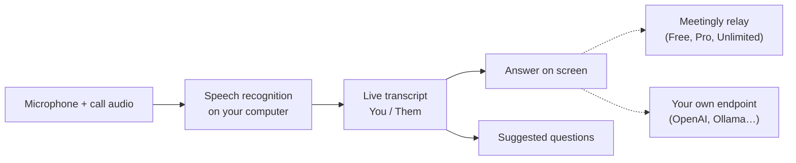

<div align="center">


# Meetingly

**질문이 끝나기도 전에 답을.**

실시간 회의와 인터뷰를 위한 오픈 소스 AI 어시스턴트입니다. 통화를 듣고 내 컴퓨터에서 텍스트로 변환하며, 질문이 나오자마자 화면에 답을 띄웁니다. 계정으로 무료 사용하거나, 직접 OpenAI, OpenRouter 또는 Ollama 키를 가져오세요. Cluely의 오픈 소스 대안입니다.

<p align="center"><!-- languages --><a href="README.md">English</a> · <a href="README.zh-CN.md">简体中文</a> · <a href="README.ru.md">Русский</a> · <a href="README.es.md">Español</a> · <a href="README.pt-BR.md">Português</a> · <a href="README.ja.md">日本語</a> · <b>한국어</b></p>

<a href="https://meetinglyai.com/download/Meetingly-Setup.exe"></a>
&nbsp;
<a href="https://meetinglyai.com/download/Meetingly-mac-arm64.dmg"></a>
&nbsp;
<a href="https://meetinglyai.com/download/Meetingly-linux.AppImage"></a>

<sub>추가: <a href="https://meetinglyai.com/download/Meetingly-mac-x64.dmg">Intel Mac</a> · <a href="https://meetinglyai.com/download/Meetingly-linux.deb">Debian / Ubuntu (.deb)</a> · <a href="https://meetinglyai.com/download/Meetingly.exe">Windows portable</a> · <a href="https://meetinglyai.com">meetinglyai.com</a></sub>


</div>

## 기능

- **진짜 답을 즉시.** 상대가 무언가를 물으면 바로 답이 나타납니다. 말할 수 있는 굵은 한 줄과, 이어서 확장할 몇 가지 포인트를 제공합니다. 코칭도, "이런 걸 언급해도 됩니다…"도 없습니다.
- **추천 질문.** 사이드 컬럼이 대화를 따라가며 한 번 클릭으로 쓸 수 있는 질문을 제공합니다. 방금 받은 질문, 나온 용어, 다음에 나올 가능성이 큰 질문입니다.
- **내 컴퓨터에서 음성 인식.** NVIDIA Nemotron이 28개 언어로 로컬 실행되므로 오디오는 기기를 떠나지 않으며 분당 비용도 없습니다.
- **나와 상대를 분리.** 내 마이크와 통화 오디오를 따로 텍스트로 변환해, 기록이 채팅처럼 읽힙니다.
- **화면 분석.** 한 번 클릭으로 화면의 내용(코딩 과제, 슬라이드, 질문)을 읽고 답합니다.
- **화면 공유에서 숨김.** Windows와 macOS에서 창이 화면 공유와 녹화에 포함되지 않습니다.
- **회의 보고서.** 모든 회의가 요약, 결정 사항, 액션 아이템, 후속 조치로 마무리됩니다.
- **내 API 키를 쓰거나, 우리 키를 쓰지 않거나.** 무료 플랜을 사용하거나 Meetingly를 OpenAI, OpenRouter, 로컬 Ollama 모델 또는 OpenAI 호환 엔드포인트에 연결하세요.
- Windows, macOS, Linux에서 **자동 업데이트**되며, 통화 중에는 절대 업데이트하지 않습니다.

## 사용하는 두 가지 방법

**무료 계정.** 패널에서 *Sign up free*를 클릭하세요. 카드 없이 하루 50개의 AI 답변을 제공합니다. 지침(이력서, 직무 설명), 설정, 회의 보고서는 [웹 대시보드](https://account.meetinglyai.com)에 저장되고 모든 컴퓨터와 동기화됩니다.

| | Free | Pro | Unlimited |
|---|---|---|---|
| 가격 | $0 | $19.99 / 월, 7일 무료 | $39.99 / 월 |
| AI 모델 | 빠른 AI 모델 | 최신 GPT 및 Claude 모델 | 가장 새롭고 강력한 GPT 및 Claude 모델을 가장 먼저 |
| 답변 | 하루 50개 | 하루 300개 | Unlimited (공정 사용) |
| 화면 분석 | 하루 3회 | 하루 50회 | 하루 300회 |
| 실시간 제안 | 하루 약 30분 | 하루 약 4시간 | 하루 약 8시간 |
| 회의 보고서 | 하루 1개 | 하루 20개 | 하루 100개 |
| 컴퓨터 | 1 | 2 | 3 |

[플랜 페이지](https://account.meetinglyai.com/dashboard/plan)에서 카드, SBP 또는 암호화폐로 결제하세요. Meetingly에 대해 게시하고 Pro를 무료로 받으세요. [크리에이터 보상](https://meetinglyai.com/creators/)을 확인하세요.

**내 키로, 계정 없이.** Meetingly 메뉴(시계 옆 트레이 아이콘)를 열고 *Use your own API key…*를 선택한 뒤, 제공업체를 고르고 키를 붙여넣고 모델을 선택하세요. 답변은 내 컴퓨터에서 해당 제공업체로 바로 전송됩니다. Meetingly 서버를 거치지 않으며, 제한은 제공업체의 제한뿐입니다.

| 제공업체 | API 주소 | 키 |
|---|---|---|
| OpenAI | `https://api.openai.com/v1` | platform.openai.com에서 |
| OpenRouter | `https://openrouter.ai/api/v1` | openrouter.ai에서 |
| Ollama (완전 로컬) | `http://localhost:11434/v1` | 없음 |
| OpenAI 호환 항목(LM Studio, vLLM, LiteLLM…) | 해당 `/v1` 주소 | 필요한 경우 |

키는 운영 체제의 키체인으로 암호화되어 내 컴퓨터에 저장됩니다. 화면 분석에는 이미지를 받는 모델이 필요합니다.

## Meetingly vs Cluely vs Final Round AI vs Parakeet AI

| | **Meetingly** | Cluely | Final Round AI | Parakeet AI |
|---|---|---|---|---|
| 가격 | **Free**, Pro $19.99, Unlimited $39.99 / 월 | Free 플랜, Pro $19.99 / 월 | Pro $25 / 월부터 | €129.90 / 월 또는 크레딧 |
| 무료 실시간 답변 | **매일 하루 50개** | "Limited AI responses" | 없음: 실시간 세션에는 Pro 필요 | 10분 세션 1회 |
| 화면 공유에서 숨김 | **모든 플랜, 기본 켜짐** | Pro + Undetectability만, $149.99 / 월 | Pro | 유료 플랜 |
| Linux | **AppImage 및 .deb** | — | — | Chrome에서만 |
| 오픈 소스 | **Apache-2.0** | — | — | — |
| 내 API 키 사용 | **OpenAI, OpenRouter, Ollama…** | — | — | — |

<sub>각 제품의 공식 사이트 기준(<a href="https://cluely.com/pricing">cluely.com/pricing</a>, <a href="https://www.finalroundai.com/pricing">finalroundai.com/pricing</a>, <a href="https://www.parakeet-ai.com/pricing">parakeet-ai.com/pricing</a>), 2026년 10월 5일. —는 해당 사이트에 언급되지 않았음을 뜻합니다.</sub>

<div align="center">

</div>

## 작동 방식



오디오는 컴퓨터에 남아 있습니다. AI로 전송되는 것은 transcript 텍스트, 질문, 분석하기로 선택한 스크린샷뿐입니다. Free, Pro, Unlimited 플랜에서는 Meetingly의 릴레이를 통해 전송되며(제공자 키를 보관하고 각 작업에 맞는 모델을 선택함), 직접 키를 사용할 때는 본인 엔드포인트로 바로 전송됩니다.

## 설치 참고 사항

설치 프로그램은 아직 코드 서명되지 않았으므로 첫 실행 시 한 번 확인을 요청합니다.

- **Windows:** SmartScreen에서 앱을 인식할 수 없다고 표시됩니다. *More info*를 클릭한 다음 *Run anyway*를 클릭하세요.
- **macOS:** System Settings → Privacy & Security를 열고 *Open Anyway*를 클릭하세요. 앱이 자동 업데이트될 수 있도록 Applications에 보관하세요.
- **Linux:** `chmod +x Meetingly-linux.AppImage`를 실행한 뒤 실행하거나 .deb를 설치하세요.

## 개발

```bash
cd app
npm install
npm run fetch:asr   # speech engine for your platform
npm run dev
```

| 명령어 | 설명 |
|---|---|
| `npm run dev` | 핫 리로드로 실행 |
| `npm test` | 단위 테스트 |
| `npm run typecheck` | main과 renderer 타입 검사 |
| `npm run smoke` | 모든 창을 헤드리스로 열고 renderer 오류가 있으면 실패 처리(`node scripts/smoke.mjs ownkey`는 자체 키 흐름을 테스트) |
| `npm run dist:win` | Windows 설치 프로그램 빌드(macOS 및 Linux 빌드는 GitHub Actions에서 수행) |

```
app/      desktop app: Electron 44, React 19, Vite 8, TypeScript, Tailwind
relay/    the small Node service behind the Free, Pro and Unlimited plans (holds the API keys, picks the model per task)
docs/     images for this page
```

기여를 환영합니다. [CONTRIBUTING](.github/CONTRIBUTING.md)을 참고하세요. 보안 문제는 [SECURITY](.github/SECURITY.md)를 확인하세요.

Meetingly가 도움이 되었다면 ⭐로 다른 사람들이 찾을 수 있게 도와주세요.

## Powered by AI Prime Tech

무료 플랜은 개발자와 기업을 위한 무제한 API 플랜을 제공하는 Claude API 제공업체인 **[AI Prime Tech](https://aiprimetech.io)**에서 실행됩니다.

<div align="center">
<sub>Apache-2.0 라이선스.</sub>
</div>
