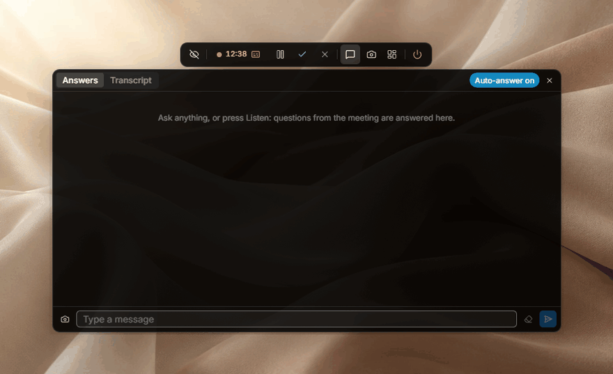
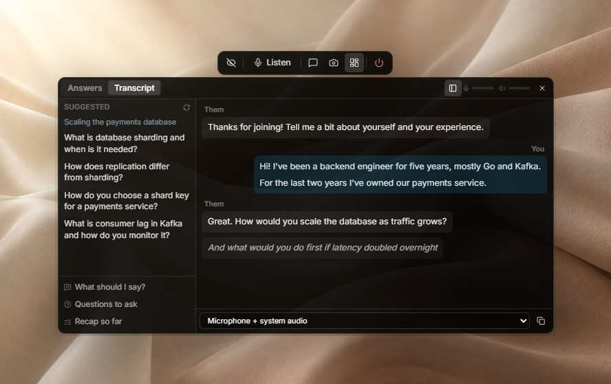
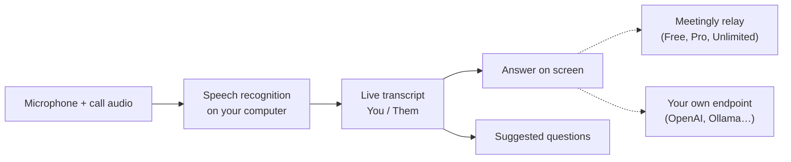

<div align="center">


# Meetingly

**The answer, while they're still asking.**

An open-source AI assistant for live meetings and interviews. It listens to the call, transcribes it on your own computer and puts the answer on screen the moment a question is asked. Free with an account, or bring your own OpenAI, OpenRouter or Ollama key. An open-source alternative to Cluely.

<p align="center"><!-- languages --><b>English</b> · <a href="README.zh-CN.md">简体中文</a> · <a href="README.ru.md">Русский</a> · <a href="README.es.md">Español</a> · <a href="README.pt-BR.md">Português</a> · <a href="README.ja.md">日本語</a> · <a href="README.ko.md">한국어</a></p>

<a href="https://meetinglyai.com/download/Meetingly-Setup.exe"></a>
&nbsp;
<a href="https://meetinglyai.com/download/Meetingly-mac-arm64.dmg"></a>
&nbsp;
<a href="https://meetinglyai.com/download/Meetingly-linux.AppImage"></a>

<sub>Also: <a href="https://meetinglyai.com/download/Meetingly-mac-x64.dmg">Intel Mac</a> · <a href="https://meetinglyai.com/download/Meetingly-linux.deb">Debian / Ubuntu (.deb)</a> · <a href="https://meetinglyai.com/download/Meetingly.exe">Windows portable</a> · <a href="https://meetinglyai.com">meetinglyai.com</a></sub>




</div>

## Features

- **Real answers, instantly.** When the other side asks something, the answer appears right away: one bold line you can say, then a few catch points to expand on. No coaching, no "you could mention…".
- **Suggested questions.** A side column follows the conversation and offers one-click questions: the question you were just asked, terms that came up, the likely next question.
- **Speech recognition on your computer.** NVIDIA Nemotron runs locally in 28 languages, so your audio never leaves your machine and there is no per-minute cost.
- **You and Them, separated.** Your microphone and the call audio are transcribed apart, so the transcript reads like a chat.
- **Screen analysis.** One click reads what is on your screen (a coding task, a slide, a question) and answers it.
- **Hidden from screen sharing.** The windows are excluded from screen shares and recordings on Windows and macOS.
- **Meeting reports.** Every meeting ends with a summary, decisions, action items and follow-ups.
- **Your own API key, or none of ours.** Use the free plan, or point Meetingly at OpenAI, OpenRouter, a local Ollama model or any OpenAI-compatible endpoint.
- **Updates itself** on Windows, macOS and Linux, never in the middle of a call.

## Two ways to use it

**Free account.** Click *Sign up free* in the panel: 50 AI answers a day, no card. Instructions (your CV, the job description), settings and meeting reports live in your [web dashboard](https://account.meetinglyai.com) and sync to every computer.

| | Free | Pro | Unlimited |
|---|---|---|---|
| Price | $0 | $19.99 / month, 7 days free | $39.99 / month |
| AI models | Fast AI models | Latest GPT and Claude models | The newest, most powerful GPT and Claude models, first |
| Answers | 50 a day | 300 a day | Unlimited (fair use) |
| Screen analysis | 3 a day | 50 a day | 300 a day |
| Live suggestions | About 30 minutes a day | About 4 hours a day | About 8 hours a day |
| Meeting reports | 1 a day | 20 a day | 100 a day |
| Computers | 1 | 2 | 3 |

Pay by card, or with SBP or crypto, on the [plan page](https://account.meetinglyai.com/dashboard/plan). Post about Meetingly and get Pro free: see the [creator reward](https://meetinglyai.com/creators/).

**Your own key, no account.** Open the Meetingly menu (the tray icon next to the clock) and choose *Use your own API key…*, pick a provider, paste a key and choose a model. Answers go straight from your computer to that provider; nothing passes through Meetingly's servers, and there are no limits but your provider's.

| Provider | API address | Key |
|---|---|---|
| OpenAI | `https://api.openai.com/v1` | from platform.openai.com |
| OpenRouter | `https://openrouter.ai/api/v1` | from openrouter.ai |
| Ollama (fully local) | `http://localhost:11434/v1` | none |
| Anything OpenAI-compatible (LM Studio, vLLM, LiteLLM…) | its `/v1` address | if it needs one |

The key is stored on your computer, encrypted with the operating system's keychain. Screen analysis needs a model that accepts images.

## Meetingly vs Cluely vs Final Round AI vs Parakeet AI

| | **Meetingly** | Cluely | Final Round AI | Parakeet AI |
|---|---|---|---|---|
| Price | **Free**, Pro $19.99, Unlimited $39.99 / month | Free plan, Pro $19.99 / month | Pro from $25 / month | €129.90 / month, or credits |
| Free live answers | **50 a day, every day** | "Limited AI responses" | None: live sessions need Pro | One 10-minute session |
| Hidden from screen sharing | **Every plan, on by default** | Only Pro + Undetectability, $149.99 / month | Pro | Paid plans |
| Linux | **AppImage and .deb** | — | — | In Chrome only |
| Open source | **Apache-2.0** | — | — | — |
| Use your own API key | **OpenAI, OpenRouter, Ollama…** | — | — | — |

<sub>From each product's own site (<a href="https://cluely.com/pricing">cluely.com/pricing</a>, <a href="https://www.finalroundai.com/pricing">finalroundai.com/pricing</a>, <a href="https://www.parakeet-ai.com/pricing">parakeet-ai.com/pricing</a>), 5 October 2026. — means not mentioned there.</sub>

<div align="center">

</div>

## How it works



Your audio stays on your computer. Only the transcript text, your questions and the screenshots you choose to analyze go to the AI: through Meetingly's relay on the Free, Pro and Unlimited plans (it holds the provider keys and picks the model for each task), or straight to your own endpoint when you use your own key.

## Install notes

The installers aren't code-signed yet, so the first launch asks once:

- **Windows:** SmartScreen says the app is unrecognized. Click *More info*, then *Run anyway*.
- **macOS:** open System Settings → Privacy & Security and click *Open Anyway*. Keep the app in Applications so it can update itself.
- **Linux:** `chmod +x Meetingly-linux.AppImage` and run it, or install the .deb.

## Development

```bash
cd app
npm install
npm run fetch:asr   # speech engine for your platform
npm run dev
```

| Command | What it does |
|---|---|
| `npm run dev` | Run with hot reload |
| `npm test` | Unit tests |
| `npm run typecheck` | Type-check main and renderer |
| `npm run smoke` | Open every window headless and fail on renderer errors (`node scripts/smoke.mjs ownkey` tests the own-key flow) |
| `npm run dist:win` | Build the Windows installer (macOS and Linux build in GitHub Actions) |

```
app/      desktop app: Electron 44, React 19, Vite 8, TypeScript, Tailwind
relay/    the small Node service behind the Free, Pro and Unlimited plans (holds the API keys, picks the model per task)
docs/     images for this page
```

Contributions are welcome, see [CONTRIBUTING](.github/CONTRIBUTING.md). Security issues: [SECURITY](.github/SECURITY.md).

If Meetingly helps you, a ⭐ helps other people find it.

## Powered by AI Prime Tech

The free plan runs on **[AI Prime Tech](https://aiprimetech.io)**, the Claude API provider with unlimited API plans for developers and companies.

<div align="center">
<sub>Apache-2.0 licensed.</sub>
</div>
