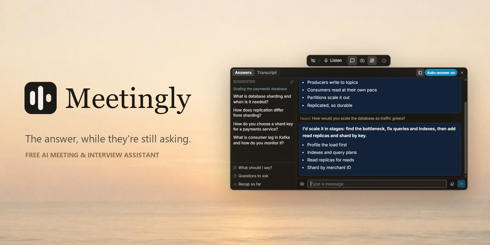
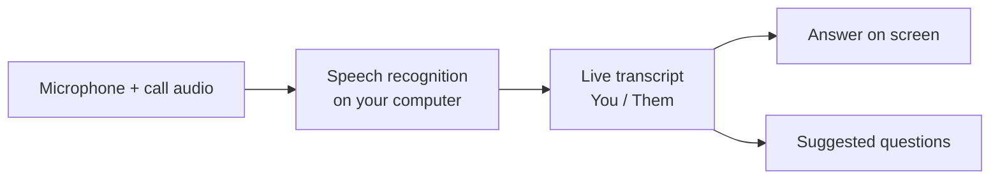

<div align="center">


# Meetingly

**The answer, while they're still asking.**

A free AI assistant for live meetings and interviews. It listens to the call, transcribes it on your own computer,<br/>
and puts the answer on screen the moment a question is asked. A free alternative to Cluely.

<a href="https://meetinglyai.com/download/Meetingly-Setup.exe"></a>
&nbsp;
<a href="https://meetinglyai.com"></a>


<a href="https://aiprimetech.io"></a>



</div>

## Features

- **Real answers, instantly.** When the other side asks something, the answer appears right away: one bold line you can say, then a few catch points to expand on. No coaching, no "you could mention…".
- **Suggested questions.** A side column follows the conversation and offers one-click questions: the question you were just asked, terms that came up, the likely next question. It remembers who you are talking to for the whole call.
- **Speech recognition on your PC.** NVIDIA Nemotron runs locally in 28 languages (the default), so your audio stays on your computer and there is no per-minute cost.
- **You and Them, separated.** Your microphone and the call audio are transcribed apart, so the transcript reads like a chat.
- **Screen analysis.** One click reads what is on your screen (a coding task, a slide, a question) and answers it.
- **Hidden from screen sharing.** The windows are excluded from screen shares and recordings on Windows and macOS.
- **Meeting reports.** Every meeting ends with a summary, decisions, action items and follow-ups.

## Meetingly vs Cluely vs LockedIn AI

| | **Meetingly** | Cluely | LockedIn AI |
|---|---|---|---|
| Price | **Free** | Free plan with limited answers, Pro $19.99 / month | From $54.99 / month (promo, $109.98 standard) |
| Free answers | **100 a day** | Limited | No free plan on its pricing page |
| Audio recording and live transcript | **Free, on your computer** | Paid: on the free plan it opens the subscription page | Paid plans only |
| Hidden from screen sharing | **Included, on by default** | Only in Pro + Undetectability, $149.99 / month | Not on its pricing page |

<sub>Prices from <a href="https://cluely.com/pricing">cluely.com/pricing</a> and <a href="https://www.lockedinai.com/pricing">lockedinai.com/pricing</a>, October 2026.</sub>

<div align="center">

</div>

## How it works



Your audio stays on your computer. Only the transcript text, your questions and the screenshots you choose to analyze go to a small relay, which holds the API keys and picks the AI model for each task. Settings and meetings stay on your computer too.

## Development

```bash
cd app
npm install
npm run fetch:asr   # speech engine for your platform
npm run dev
```

| Command | What it does |
|---|---|
| `npm run dev` | Run with hot reload |
| `npm test` | Unit tests |
| `npm run typecheck` | Type-check main and renderer |
| `npm run dist:win` | Build the Windows installer |

```
app/      desktop app: Electron 44, React 19, Vite 8, TypeScript, Tailwind
relay/    small Node service that holds the API keys and routes each task to a model
docs/     images for this page
```

Contributions are welcome, see [CONTRIBUTING](.github/CONTRIBUTING.md). Security issues: [SECURITY](.github/SECURITY.md).

## Powered by AI Prime Tech

Meetingly is free thanks to **[AI Prime Tech](https://aiprimetech.io)**, the Claude API provider with unlimited API plans for developers and companies.

<div align="center">
<sub>Apache-2.0 licensed.</sub>
</div>
