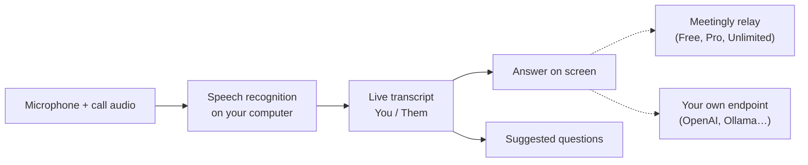

<div align="center">


# Meetingly

**A resposta, enquanto ainda estão perguntando.**

Um assistente de AI open-source para reuniões e entrevistas ao vivo. Ele ouve a chamada, transcreve no seu próprio computador e coloca a resposta na tela no momento em que uma pergunta é feita. Grátis com uma conta, ou use sua própria chave OpenAI, OpenRouter ou Ollama. Uma alternativa open-source ao Cluely.

<p align="center"><!-- languages --><a href="README.md">English</a> · <a href="README.zh-CN.md">简体中文</a> · <a href="README.ru.md">Русский</a> · <a href="README.es.md">Español</a> · <b>Português</b> · <a href="README.ja.md">日本語</a> · <a href="README.ko.md">한국어</a></p>

<a href="https://meetinglyai.com/download/Meetingly-Setup.exe"></a>
&nbsp;
<a href="https://meetinglyai.com/download/Meetingly-mac-arm64.dmg"></a>
&nbsp;
<a href="https://meetinglyai.com/download/Meetingly-linux.AppImage"></a>

<sub>Também: <a href="https://meetinglyai.com/download/Meetingly-mac-x64.dmg">Intel Mac</a> · <a href="https://meetinglyai.com/download/Meetingly-linux.deb">Debian / Ubuntu (.deb)</a> · <a href="https://meetinglyai.com/download/Meetingly.exe">Windows portátil</a> · <a href="https://meetinglyai.com">meetinglyai.com</a></sub>


</div>

## Recursos

- **Respostas reais, instantâneas.** Quando a outra pessoa pergunta algo, a resposta aparece na hora: uma linha em negrito que você pode dizer, depois alguns pontos para desenvolver. Sem coaching, sem "você poderia mencionar…".
- **Perguntas sugeridas.** Uma coluna lateral acompanha a conversa e oferece perguntas com um clique: a pergunta que acabaram de fazer, termos que surgiram, a provável próxima pergunta.
- **Reconhecimento de fala no seu computador.** NVIDIA Nemotron roda localmente em 28 idiomas, então seu áudio nunca sai da sua máquina e não há custo por minuto.
- **Você e Eles, separados.** Seu microfone e o áudio da chamada são transcritos separadamente, então a transcrição parece um chat.
- **Análise de tela.** Um clique lê o que está na sua tela (uma tarefa de código, um slide, uma pergunta) e responde.
- **Oculto no compartilhamento de tela.** As janelas são excluídas de compartilhamentos de tela e gravações no Windows e macOS.
- **Relatórios de reunião.** Toda reunião termina com um resumo, decisões, itens de ação e acompanhamentos.
- **Sua própria chave de API, ou nenhuma nossa.** Use o plano grátis, ou aponte o Meetingly para OpenAI, OpenRouter, um modelo Ollama local ou qualquer endpoint compatível com OpenAI.
- **Atualiza sozinho** no Windows, macOS e Linux, nunca no meio de uma chamada.

## Duas formas de usar

**Conta grátis.** Clique em *Sign up free* no painel: 50 respostas de AI por dia, sem cartão. Instruções (seu currículo, a descrição da vaga), configurações e relatórios de reunião ficam no seu [dashboard web](https://account.meetinglyai.com) e sincronizam com todos os computadores.

| | Free | Pro | Unlimited |
|---|---|---|---|
| Preço | $0 | $19.99 / mês, 7 dias grátis | $39.99 / mês |
| Modelos de AI | Modelos de AI rápidos | Modelos GPT e Claude mais recentes | Os modelos GPT e Claude mais novos e poderosos, primeiro |
| Respostas | 50 por dia | 300 por dia | Unlimited (uso justo) |
| Análise de tela | 3 por dia | 50 por dia | 300 por dia |
| Sugestões ao vivo | Cerca de 30 minutos por dia | Cerca de 4 horas por dia | Cerca de 8 horas por dia |
| Relatórios de reunião | 1 por dia | 20 por dia | 100 por dia |
| Computadores | 1 | 2 | 3 |

Pague com cartão, ou com SBP ou cripto, na [página de planos](https://account.meetinglyai.com/dashboard/plan). Publique sobre o Meetingly e ganhe Pro grátis: veja a [recompensa para criadores](https://meetinglyai.com/creators/).

**Sua própria chave, sem conta.** Abra o menu do Meetingly (o ícone na bandeja ao lado do relógio) e escolha *Use your own API key…*, selecione um provedor, cole uma chave e escolha um modelo. As respostas vão direto do seu computador para esse provedor; nada passa pelos servidores do Meetingly, e não há limites além dos do seu provedor.

| Provedor | Endereço da API | Chave |
|---|---|---|
| OpenAI | `https://api.openai.com/v1` | de platform.openai.com |
| OpenRouter | `https://openrouter.ai/api/v1` | de openrouter.ai |
| Ollama (totalmente local) | `http://localhost:11434/v1` | nenhuma |
| Qualquer coisa compatível com OpenAI (LM Studio, vLLM, LiteLLM…) | seu endereço `/v1` | se precisar de uma |

A chave fica armazenada no seu computador, criptografada com o chaveiro do sistema operacional. A análise de tela precisa de um modelo que aceite imagens.

## Meetingly vs Cluely vs Final Round AI vs Parakeet AI

| | **Meetingly** | Cluely | Final Round AI | Parakeet AI |
|---|---|---|---|---|
| Preço | **Free**, Pro $19.99, Unlimited $39.99 / mês | Plano Free, Pro $19.99 / mês | Pro a partir de $25 / mês | €129.90 / mês, ou créditos |
| Respostas ao vivo grátis | **50 por dia, todos os dias** | "Respostas de AI limitadas" | Nenhuma: sessões ao vivo precisam do Pro | Uma sessão de 10 minutos |
| Oculto no compartilhamento de tela | **Todos os planos, ativado por padrão** | Apenas Pro + Undetectability, $149.99 / mês | Pro | Planos pagos |
| Linux | **AppImage e .deb** | — | — | Apenas no Chrome |
| Open source | **Apache-2.0** | — | — | — |
| Use sua própria chave de API | **OpenAI, OpenRouter, Ollama…** | — | — | — |

<sub>Dos sites de cada produto (<a href="https://cluely.com/pricing">cluely.com/pricing</a>, <a href="https://www.finalroundai.com/pricing">finalroundai.com/pricing</a>, <a href="https://www.parakeet-ai.com/pricing">parakeet-ai.com/pricing</a>), 5 de outubro de 2026. — significa que não é mencionado lá.</sub>

<div align="center">

</div>

## Como funciona



Seu áudio fica no seu computador. Apenas o texto da transcrição, suas perguntas e as capturas de tela que você escolher analisar vão para a AI: pelo relay do Meetingly nos planos Free, Pro e Unlimited (ele guarda as chaves do provedor e escolhe o modelo para cada tarefa), ou direto para seu próprio endpoint quando você usa sua própria chave.

## Notas de instalação

Os instaladores ainda não têm assinatura de código, então a primeira execução pede uma vez:

- **Windows:** o SmartScreen diz que o app não é reconhecido. Clique em *Mais informações* e depois em *Executar assim mesmo*.
- **macOS:** abra Ajustes do Sistema → Privacidade e Segurança e clique em *Abrir Mesmo Assim*. Mantenha o app em Aplicativos para que ele possa se atualizar sozinho.
- **Linux:** `chmod +x Meetingly-linux.AppImage` e execute, ou instale o .deb.

## Desenvolvimento

```bash
cd app
npm install
npm run fetch:asr   # speech engine for your platform
npm run dev
```

| Comando | O que faz |
|---|---|
| `npm run dev` | Executa com hot reload |
| `npm test` | Testes unitários |
| `npm run typecheck` | Verifica tipos no main e no renderer |
| `npm run smoke` | Abre todas as janelas em modo headless e falha em erros do renderer (`node scripts/smoke.mjs ownkey` testa o fluxo com chave própria) |
| `npm run dist:win` | Gera o instalador do Windows (macOS e Linux são gerados no GitHub Actions) |

```
app/      desktop app: Electron 44, React 19, Vite 8, TypeScript, Tailwind
relay/    the small Node service behind the Free, Pro and Unlimited plans (holds the API keys, picks the model per task)
docs/     images for this page
```

Contribuições são bem-vindas; veja [CONTRIBUTING](.github/CONTRIBUTING.md). Problemas de segurança: [SECURITY](.github/SECURITY.md).

Se o Meetingly te ajuda, uma ⭐ ajuda outras pessoas a encontrá-lo.

## Com tecnologia da AI Prime Tech

O plano gratuito roda na **[AI Prime Tech](https://aiprimetech.io)**, a provedora da API Claude com planos de API ilimitados para desenvolvedores e empresas.

<div align="center">
<sub>Licenciado sob Apache-2.0.</sub>
</div>
