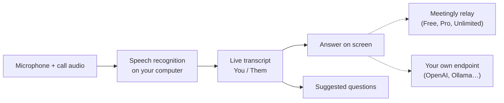

<div align="center">


# Meetingly

**Ответ — пока вопрос ещё задают.**

Open-source AI-ассистент для живых встреч и интервью. Он слушает звонок, расшифровывает его на вашем компьютере и выводит ответ на экран в момент, когда задают вопрос. Бесплатно с аккаунтом или со своим ключом OpenAI, OpenRouter или Ollama. Open-source альтернатива Cluely.

<p align="center"><!-- languages --><a href="README.md">English</a> · <a href="README.zh-CN.md">简体中文</a> · <b>Русский</b> · <a href="README.es.md">Español</a> · <a href="README.pt-BR.md">Português</a> · <a href="README.ja.md">日本語</a> · <a href="README.ko.md">한국어</a></p>

<a href="https://meetinglyai.com/download/Meetingly-Setup.exe"></a>
&nbsp;
<a href="https://meetinglyai.com/download/Meetingly-mac-arm64.dmg"></a>
&nbsp;
<a href="https://meetinglyai.com/download/Meetingly-linux.AppImage"></a>

<sub>Также: <a href="https://meetinglyai.com/download/Meetingly-mac-x64.dmg">Intel Mac</a> · <a href="https://meetinglyai.com/download/Meetingly-linux.deb">Debian / Ubuntu (.deb)</a> · <a href="https://meetinglyai.com/download/Meetingly.exe">Windows portable</a> · <a href="https://meetinglyai.com">meetinglyai.com</a></sub>


</div>

## Возможности

- **Настоящие ответы — мгновенно.** Когда собеседник что-то спрашивает, ответ появляется сразу: одна жирная строка, которую можно произнести, и несколько опорных пунктов для развития мысли. Никакого коучинга и «можно упомянуть…».
- **Подсказки с вопросами.** Боковая колонка следит за разговором и предлагает вопросы в один клик: только что заданный вопрос, всплывшие термины, вероятный следующий вопрос.
- **Распознавание речи на вашем компьютере.** NVIDIA Nemotron работает локально на 28 языках, поэтому аудио не покидает ваш компьютер и нет поминутной оплаты.
- **Вы и собеседники — отдельно.** Ваш микрофон и звук звонка расшифровываются раздельно, поэтому расшифровка читается как чат.
- **Анализ экрана.** Один клик считывает то, что на экране (задачу по коду, слайд, вопрос), и отвечает.
- **Скрыто при демонстрации экрана.** Окна исключаются из демонстраций экрана и записей на Windows и macOS.
- **Отчёты по встречам.** Каждая встреча заканчивается кратким итогом, решениями, задачами и последующими шагами.
- **Свой API-ключ — или ни одного нашего.** Используйте бесплатный план или подключите Meetingly к OpenAI, OpenRouter, локальной модели Ollama или любому OpenAI-совместимому endpoint.
- **Обновляется сам** на Windows, macOS и Linux — никогда во время звонка.

## Два способа использовать

**Бесплатный аккаунт.** Нажмите *Sign up free* на панели: 50 AI-ответов в день, карта не нужна. Инструкции (ваше резюме, описание вакансии), настройки и отчёты по встречам находятся в [web dashboard](https://account.meetinglyai.com) и синхронизируются на все компьютеры.

| | Free | Pro | Unlimited |
|---|---|---|---|
| Цена | $0 | $19.99 / месяц, 7 дней бесплатно | $39.99 / месяц |
| AI-модели | Быстрые AI-модели | Новейшие модели GPT и Claude | Самые новые и мощные модели GPT и Claude — первыми |
| Ответы | 50 в день | 300 в день | Unlimited (добросовестное использование) |
| Анализ экрана | 3 в день | 50 в день | 300 в день |
| Подсказки в реальном времени | Около 30 минут в день | Около 4 часов в день | Около 8 часов в день |
| Отчёты по встречам | 1 в день | 20 в день | 100 в день |
| Компьютеры | 1 | 2 | 3 |

Оплатите картой, через SBP или криптовалютой на [странице плана](https://account.meetinglyai.com/dashboard/plan). Расскажите о Meetingly и получите Pro бесплатно: см. [creator reward](https://meetinglyai.com/creators/).

**Свой ключ, без аккаунта.** Откройте меню Meetingly (значок в трее рядом с часами) и выберите *Use your own API key…*, выберите провайдера, вставьте ключ и выберите модель. Ответы идут напрямую с вашего компьютера к этому провайдеру; через серверы Meetingly ничего не проходит, а лимиты — только у вашего провайдера.

| Провайдер | API-адрес | Ключ |
|---|---|---|
| OpenAI | `https://api.openai.com/v1` | с platform.openai.com |
| OpenRouter | `https://openrouter.ai/api/v1` | с openrouter.ai |
| Ollama (полностью локально) | `http://localhost:11434/v1` | нет |
| Любой OpenAI-совместимый вариант (LM Studio, vLLM, LiteLLM…) | его адрес `/v1` | если нужен |

Ключ хранится на вашем компьютере и шифруется через системное хранилище ключей. Для анализа экрана нужна модель, которая принимает изображения.

## Meetingly vs Cluely vs Final Round AI vs Parakeet AI

| | **Meetingly** | Cluely | Final Round AI | Parakeet AI |
|---|---|---|---|---|
| Цена | **Free**, Pro $19.99, Unlimited $39.99 / месяц | Free-план, Pro $19.99 / месяц | Pro от $25 / месяц | €129.90 / месяц или кредиты |
| Бесплатные ответы в реальном времени | **50 в день, каждый день** | "Limited AI responses" | Нет: для live-сессий нужен Pro | Одна 10-минутная сессия |
| Скрыто при демонстрации экрана | **На каждом плане, включено по умолчанию** | Только Pro + Undetectability, $149.99 / месяц | Pro | Платные планы |
| Linux | **AppImage и .deb** | — | — | Только в Chrome |
| Open source | **Apache-2.0** | — | — | — |
| Свой API-ключ | **OpenAI, OpenRouter, Ollama…** | — | — | — |

<sub>С сайтов самих продуктов (<a href="https://cluely.com/pricing">cluely.com/pricing</a>, <a href="https://www.finalroundai.com/pricing">finalroundai.com/pricing</a>, <a href="https://www.parakeet-ai.com/pricing">parakeet-ai.com/pricing</a>), 5 октября 2026. — означает, что там не упомянуто.</sub>

<div align="center">

</div>

## Как это работает



Ваш звук остаётся на вашем компьютере. В AI отправляются только текст расшифровки, ваши вопросы и выбранные вами для анализа скриншоты: через relay Meetingly на тарифах Free, Pro и Unlimited (он хранит ключи провайдера и выбирает модель для каждой задачи) или напрямую в ваш endpoint, если вы используете собственный ключ.

## Примечания по установке

Установщики пока не подписаны кодовой подписью, поэтому при первом запуске появится один запрос:

- **Windows:** SmartScreen сообщит, что приложение не распознано. Нажмите *More info*, затем *Run anyway*.
- **macOS:** откройте System Settings → Privacy & Security и нажмите *Open Anyway*. Держите приложение в Applications, чтобы оно могло обновляться самостоятельно.
- **Linux:** выполните `chmod +x Meetingly-linux.AppImage` и запустите его или установите .deb.

## Разработка

```bash
cd app
npm install
npm run fetch:asr   # speech engine for your platform
npm run dev
```

| Команда | Что делает |
|---|---|
| `npm run dev` | Запуск с горячей перезагрузкой |
| `npm test` | Модульные тесты |
| `npm run typecheck` | Проверка типов main и renderer |
| `npm run smoke` | Открывает каждое окно в headless-режиме и завершается с ошибкой при ошибках renderer (`node scripts/smoke.mjs ownkey` проверяет сценарий с собственным ключом) |
| `npm run dist:win` | Собирает установщик Windows (macOS и Linux собираются в GitHub Actions) |

```
app/      desktop app: Electron 44, React 19, Vite 8, TypeScript, Tailwind
relay/    the small Node service behind the Free, Pro and Unlimited plans (holds the API keys, picks the model per task)
docs/     images for this page
```

Вклады приветствуются, см. [CONTRIBUTING](.github/CONTRIBUTING.md). Вопросы безопасности: [SECURITY](.github/SECURITY.md).

Если Meetingly вам помогает, ⭐ поможет другим людям найти его.

## Работает на AI Prime Tech

Бесплатный тариф работает на **[AI Prime Tech](https://aiprimetech.io)**, провайдере Claude API с безлимитными API-тарифами для разработчиков и компаний.

<div align="center">
<sub>Лицензия Apache-2.0.</sub>
</div>
