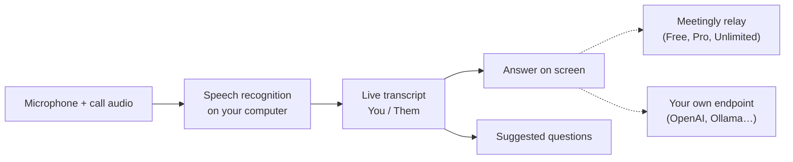

<div align="center">


# Meetingly

**他们还在问，答案已经出现。**

一款用于实时会议和面试的开源 AI 助手。它会监听通话，在你的电脑上转写，并在问题被问出的瞬间把答案显示在屏幕上。注册账号即可免费使用，也可以自带 OpenAI、OpenRouter 或 Ollama 密钥。Cluely 的开源替代品。

<p align="center"><!-- languages --><a href="README.md">English</a> · <b>简体中文</b> · <a href="README.ru.md">Русский</a> · <a href="README.es.md">Español</a> · <a href="README.pt-BR.md">Português</a> · <a href="README.ja.md">日本語</a> · <a href="README.ko.md">한국어</a></p>

<a href="https://meetinglyai.com/download/Meetingly-Setup.exe"></a>
&nbsp;
<a href="https://meetinglyai.com/download/Meetingly-mac-arm64.dmg"></a>
&nbsp;
<a href="https://meetinglyai.com/download/Meetingly-linux.AppImage"></a>

<sub>另有：<a href="https://meetinglyai.com/download/Meetingly-mac-x64.dmg">Intel Mac</a> · <a href="https://meetinglyai.com/download/Meetingly-linux.deb">Debian / Ubuntu (.deb)</a> · <a href="https://meetinglyai.com/download/Meetingly.exe">Windows 便携版</a> · <a href="https://meetinglyai.com">meetinglyai.com</a></sub>


</div>

## 功能

- **真正的答案，立即出现。** 对方一提问，答案马上出现：一句可以直接说的加粗回答，再加几个可展开的要点。没有辅导式废话，也没有“你可以提到…”。
- **问题建议。** 侧边栏会跟随对话并提供一键提问：刚刚被问到的问题、出现过的术语、可能的下一个问题。
- **在你的电脑上语音识别。** NVIDIA Nemotron 以 28 种语言本地运行，因此你的音频不会离开设备，也没有按分钟计费。
- **你和对方，分开记录。** 你的麦克风和通话音频会分别转写，因此转写稿读起来像聊天记录。
- **屏幕分析。** 一键读取屏幕内容（编程题、幻灯片、问题）并给出答案。
- **屏幕共享中隐藏。** 在 Windows 和 macOS 上，窗口会从屏幕共享和录制中排除。
- **会议报告。** 每场会议结束后都会生成摘要、决策、行动项和后续事项。
- **使用你自己的 API 密钥，或不使用我们的。** 使用免费计划，或将 Meetingly 指向 OpenAI、OpenRouter、本地 Ollama 模型或任何兼容 OpenAI 的端点。
- 在 Windows、macOS 和 Linux 上**自动更新**，且绝不会在通话过程中更新。

## 两种使用方式

**免费账号。** 在面板中点击 *Sign up free*：每天 50 次 AI 回答，无需银行卡。说明（你的简历、职位描述）、设置和会议报告都在你的 [网页仪表盘](https://account.meetinglyai.com) 中，并同步到每台电脑。

| | Free | Pro | Unlimited |
|---|---|---|---|
| 价格 | $0 | $19.99 / 月，免费 7 天 | $39.99 / 月 |
| AI 模型 | 快速 AI 模型 | 最新 GPT 和 Claude 模型 | 最新、最强大的 GPT 和 Claude 模型，优先使用 |
| 回答 | 每天 50 次 | 每天 300 次 | Unlimited（合理使用） |
| 屏幕分析 | 每天 3 次 | 每天 50 次 | 每天 300 次 |
| 实时建议 | 每天约 30 分钟 | 每天约 4 小时 | 每天约 8 小时 |
| 会议报告 | 每天 1 份 | 每天 20 份 | 每天 100 份 |
| 电脑数 | 1 | 2 | 3 |

可在[计划页面](https://account.meetinglyai.com/dashboard/plan)用银行卡、SBP 或加密货币支付。发布关于 Meetingly 的内容可免费获得 Pro：查看[创作者奖励](https://meetinglyai.com/creators/)。

**使用自己的密钥，无需账号。** 打开 Meetingly 菜单（时钟旁的托盘图标），选择 *Use your own API key…*，选择提供商，粘贴密钥并选择模型。答案会直接从你的电脑发送到该提供商；不会经过 Meetingly 的服务器，限制也只有你的提供商设定的限制。

| 提供商 | API 地址 | 密钥 |
|---|---|---|
| OpenAI | `https://api.openai.com/v1` | 来自 platform.openai.com |
| OpenRouter | `https://openrouter.ai/api/v1` | 来自 openrouter.ai |
| Ollama（完全本地） | `http://localhost:11434/v1` | 无 |
| 任何兼容 OpenAI 的服务（LM Studio、vLLM、LiteLLM…） | 它的 `/v1` 地址 | 如果需要的话 |

密钥存储在你的电脑上，并使用操作系统的钥匙串加密。屏幕分析需要支持图像的模型。

## Meetingly vs Cluely vs Final Round AI vs Parakeet AI

| | **Meetingly** | Cluely | Final Round AI | Parakeet AI |
|---|---|---|---|---|
| 价格 | **Free**，Pro $19.99，Unlimited $39.99 / 月 | 免费计划，Pro $19.99 / 月 | Pro 起价 $25 / 月 | €129.90 / 月，或点数 |
| 免费实时回答 | **每天 50 次，天天可用** | "Limited AI responses" | 无：实时会话需要 Pro | 一次 10 分钟会话 |
| 屏幕共享中隐藏 | **所有计划，默认开启** | 仅 Pro + Undetectability，$149.99 / 月 | Pro | 付费计划 |
| Linux | **AppImage and .deb** | — | — | 仅 Chrome |
| 开源 | **Apache-2.0** | — | — | — |
| 使用自己的 API 密钥 | **OpenAI, OpenRouter, Ollama…** | — | — | — |

<sub>来自各产品官网（<a href="https://cluely.com/pricing">cluely.com/pricing</a>、<a href="https://www.finalroundai.com/pricing">finalroundai.com/pricing</a>、<a href="https://www.parakeet-ai.com/pricing">parakeet-ai.com/pricing</a>），2026 年 10 月 5 日。— 表示官网未提及。</sub>

<div align="center">

</div>

## 工作原理



你的音频会留在你的电脑上。只有转录文本、你的问题以及你选择分析的截图会发送给 AI：在 Free、Pro 和 Unlimited 计划中通过 Meetingly 的中继（它保存提供商密钥，并为每个任务选择模型），或在使用你自己的密钥时直接发送到你自己的端点。

## 安装说明

安装包尚未进行代码签名，因此首次启动时会提示一次：

- **Windows:** SmartScreen 会提示该应用无法识别。点击 *More info*，然后点击 *Run anyway*。
- **macOS:** 打开系统设置 → 隐私与安全性，然后点击 *Open Anyway*。请将应用保留在“应用程序”中，以便它自行更新。
- **Linux:** 执行 `chmod +x Meetingly-linux.AppImage` 并运行它，或安装 .deb。

## 开发

```bash
cd app
npm install
npm run fetch:asr   # speech engine for your platform
npm run dev
```

| 命令 | 作用 |
|---|---|
| `npm run dev` | 以热重载方式运行 |
| `npm test` | 单元测试 |
| `npm run typecheck` | 对 main 和 renderer 进行类型检查 |
| `npm run smoke` | 以无头模式打开每个窗口，并在 renderer 出错时失败（`node scripts/smoke.mjs ownkey` 测试自带密钥流程） |
| `npm run dist:win` | 构建 Windows 安装包（macOS 和 Linux 在 GitHub Actions 中构建） |

```
app/      desktop app: Electron 44, React 19, Vite 8, TypeScript, Tailwind
relay/    the small Node service behind the Free, Pro and Unlimited plans (holds the API keys, picks the model per task)
docs/     images for this page
```

欢迎贡献，参见 [CONTRIBUTING](.github/CONTRIBUTING.md)。安全问题： [SECURITY](.github/SECURITY.md)。

如果 Meetingly 对你有帮助，点一个 ⭐ 可以帮助更多人发现它。

## 由 AI Prime Tech 提供支持

免费计划运行在 **[AI Prime Tech](https://aiprimetech.io)** 上，这是为开发者和公司提供无限 API 计划的 Claude API 提供商。

<div align="center">
<sub>Apache-2.0 许可。</sub>
</div>
